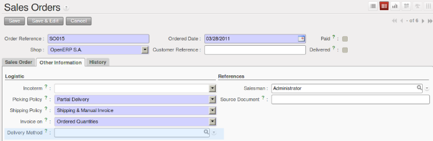

.. i18n: Financial Inventory Management
.. i18n: ==============================
..

Financial Inventory Management
==============================

.. i18n: Manual and Real-time Stock Valuation
.. i18n: ------------------------------------
.. i18n: If you have experience of managing with traditional software, you will know the problem of getting useful 
.. i18n: indicators. If you ask your accountant for a stock valuation or the value added by production, he will give you 
.. i18n: a figure.
..

Manual and Real-time Stock Valuation
------------------------------------
If you have experience of managing with traditional software, you will know the problem of getting useful 
indicators. If you ask your accountant for a stock valuation or the value added by production, he will give you 
a figure.

.. i18n: If you ask for the same figure from your stores manager, you will get an entirely different amount. You have no
.. i18n: idea who is right!
..

If you ask for the same figure from your stores manager, you will get an entirely different amount. You have no
idea who is right!

.. i18n: In OpenERP, stock management is completely integrated with the accounts, to give strong coherence between 
.. i18n: the two systems. The double-entry structure of locations enables a very precise correspondence between
.. i18n: stocks and accounts.
..

In OpenERP, stock management is completely integrated with the accounts, to give strong coherence between 
the two systems. The double-entry structure of locations enables a very precise correspondence between
stocks and accounts.

.. i18n: Each stock movement also generates a corresponding accounting entry in an accounting journal to ensure that the
.. i18n: two systems can stay in permanent synchronization.
..

Each stock movement also generates a corresponding accounting entry in an accounting journal to ensure that the
two systems can stay in permanent synchronization.

.. i18n: To do that, set up a general account for each location that should be valued in your accounts. If a product goes
.. i18n: to one location or another and the accounts are different in the two locations, OpenERP automatically generates 
.. i18n: the corresponding accounting entries in the accounts, in the stock journal.
..

To do that, set up a general account for each location that should be valued in your accounts. If a product goes
to one location or another and the accounts are different in the two locations, OpenERP automatically generates 
the corresponding accounting entries in the accounts, in the stock journal.

.. i18n: If a stock move will go from a location without an account to a location where an account has been assigned (for
.. i18n: example goods receipt from a supplier order), OpenERP generates an accounting entry using the properties defined
.. i18n: in the product form for the counterpart. You can use different accounts per location or link several locations 
.. i18n: to the same account, depending on the level of analysis needed.
..

If a stock move will go from a location without an account to a location where an account has been assigned (for
example goods receipt from a supplier order), OpenERP generates an accounting entry using the properties defined
in the product form for the counterpart. You can use different accounts per location or link several locations 
to the same account, depending on the level of analysis needed.

.. i18n: You use this system for managing consigned stocks:
..

You use this system for managing consigned stocks:

.. i18n: * a supplier location that is valued in your own accounts or,
.. i18n: * a location in your own company that is not valued in your accounts.
..

* a supplier location that is valued in your own accounts or,
* a location in your own company that is not valued in your accounts.

.. i18n: *How to Configure Accounting Valuation?*
..

*How to Configure Accounting Valuation?*

.. i18n: In the Product form, go to the ``Accounting`` tab and select the ``Real Time`` (automated) option for Inventory Valuation,
..

In the Product form, go to the ``Accounting`` tab and select the ``Real Time`` (automated) option for Inventory Valuation,

.. i18n: To define your accounts, you have two options. Set them on the product category, or on the product.
..

To define your accounts, you have two options. Set them on the product category, or on the product.

.. i18n: 1. From the ``Accounting Stock Properties`` section, for the Product Category, set the ``Stock Input Account``, the ``Stock Output Account`` and the ``Stock Variation Account``,
.. i18n: 
.. i18n: 2. From the ``Accounting`` tab, for the Product, set the ``Stock Input Account`` and the ``Stock Output Account``.
..

1. From the ``Accounting Stock Properties`` section, for the Product Category, set the ``Stock Input Account``, the ``Stock Output Account`` and the ``Stock Variation Account``,

2. From the ``Accounting`` tab, for the Product, set the ``Stock Input Account`` and the ``Stock Output Account``.

.. i18n: You can also overwrite the accounts from the Product or the Product Category by defining Stock Input Account
.. i18n: and Stock Output Account for a Location.
..

You can also overwrite the accounts from the Product or the Product Category by defining Stock Input Account
and Stock Output Account for a Location.

.. i18n: .. note:: account_anglo_saxon 
.. i18n: 	
.. i18n: 	You can also install the account_anglo_saxon module (Reconfigure wizard, Anglo-Saxon Accounting) to value
.. i18n: 	your stock according to Anglo-saxon principles.
.. i18n:     
.. i18n: The figure below shows the various accounts that can be used, with and without the account_anglo_saxon
.. i18n: module installed.
..

.. note:: account_anglo_saxon 
	
	You can also install the account_anglo_saxon module (Reconfigure wizard, Anglo-Saxon Accounting) to value
	your stock according to Anglo-saxon principles.
    
The figure below shows the various accounts that can be used, with and without the account_anglo_saxon
module installed.

.. i18n: .. figure:: images/account_anglo_saxon.png
.. i18n: 	:scale: 80
.. i18n: 	:align: center
.. i18n: 	
.. i18n: 	*Setting up Stock Valuation Accounts*
.. i18n:     
.. i18n: Managing Transportation Costs
.. i18n: -----------------------------
..

.. figure:: images/account_anglo_saxon.png
	:scale: 80
	:align: center
	
	*Setting up Stock Valuation Accounts*
    
Managing Transportation Costs
-----------------------------

.. i18n: In OpenERP, you can handle the delivery methods when installing the :mod:`delivery` module.
..

In OpenERP, you can handle the delivery methods when installing the :mod:`delivery` module.

.. i18n: This module will allow you:
..

This module will allow you:

.. i18n: * To select the delivery company
..

* To select the delivery company

.. i18n: .. figure:: images/delivery_method_form.png
.. i18n: 	:scale: 75
.. i18n: 	:align: center
.. i18n: 	
.. i18n: 	*Define the Delivery Method*
.. i18n: 	
.. i18n: * To define the delivery pricelist according to the price, the weight or the volume.
..

.. figure:: images/delivery_method_form.png
	:scale: 75
	:align: center
	
	*Define the Delivery Method*
	
* To define the delivery pricelist according to the price, the weight or the volume.

.. i18n: .. figure:: images/grid_lines.png
.. i18n: 	:scale: 75
.. i18n: 	:align: center
.. i18n: 	
.. i18n: 	*Define the Delivery Costs*
..

.. figure:: images/grid_lines.png
	:scale: 75
	:align: center
	
	*Define the Delivery Costs*

.. i18n: Now, in each :guilabel:`Delivery Order`, two new fields are available to enter the right 
.. i18n: value to deliver the products to the customer. You can also find a new field in the :guilabel:`Sales Order`
.. i18n: form that enables you to select a delivery method.
..

Now, in each :guilabel:`Delivery Order`, two new fields are available to enter the right 
value to deliver the products to the customer. You can also find a new field in the :guilabel:`Sales Order`
form that enables you to select a delivery method.

.. i18n: .. figure:: images/delivery_order_delivcost.png
.. i18n: 	:scale: 75
.. i18n: 	:align: center
.. i18n: 	
.. i18n: 	*Delivery Cost in the Delivery Orders*
..

.. figure:: images/delivery_order_delivcost.png
	:scale: 75
	:align: center
	
	*Delivery Cost in the Delivery Orders*

.. i18n: .. figure:: images/sale_order_delivcost.png	
.. i18n: 	:scale: 75
.. i18n: 	:align: center
.. i18n: 	
.. i18n: 	*Delivery Method in the Sales Orders*
..

	
	*Delivery Method in the Sales Orders*

.. i18n: .. Copyright © Open Object Press. All rights reserved.
..

.. Copyright © Open Object Press. All rights reserved.

.. i18n: .. You may take electronic copy of this publication and distribute it if you don't
.. i18n: .. change the content. You can also print a copy to be read by yourself only.
..

.. You may take electronic copy of this publication and distribute it if you don't
.. change the content. You can also print a copy to be read by yourself only.

.. i18n: .. We have contracts with different publishers in different countries to sell and
.. i18n: .. distribute paper or electronic based versions of this book (translated or not)
.. i18n: .. in bookstores. This helps to distribute and promote the OpenERP product. It
.. i18n: .. also helps us to create incentives to pay contributors and authors using author
.. i18n: .. rights of these sales.
..

.. We have contracts with different publishers in different countries to sell and
.. distribute paper or electronic based versions of this book (translated or not)
.. in bookstores. This helps to distribute and promote the OpenERP product. It
.. also helps us to create incentives to pay contributors and authors using author
.. rights of these sales.

.. i18n: .. Due to this, grants to translate, modify or sell this book are strictly
.. i18n: .. forbidden, unless Tiny SPRL (representing Open Object Press) gives you a
.. i18n: .. written authorisation for this.
..

.. Due to this, grants to translate, modify or sell this book are strictly
.. forbidden, unless Tiny SPRL (representing Open Object Press) gives you a
.. written authorisation for this.

.. i18n: .. Many of the designations used by manufacturers and suppliers to distinguish their
.. i18n: .. products are claimed as trademarks. Where those designations appear in this book,
.. i18n: .. and Open Object Press was aware of a trademark claim, the designations have been
.. i18n: .. printed in initial capitals.
..

.. Many of the designations used by manufacturers and suppliers to distinguish their
.. products are claimed as trademarks. Where those designations appear in this book,
.. and Open Object Press was aware of a trademark claim, the designations have been
.. printed in initial capitals.

.. i18n: .. While every precaution has been taken in the preparation of this book, the publisher
.. i18n: .. and the authors assume no responsibility for errors or omissions, or for damages
.. i18n: .. resulting from the use of the information contained herein.
..

.. While every precaution has been taken in the preparation of this book, the publisher
.. and the authors assume no responsibility for errors or omissions, or for damages
.. resulting from the use of the information contained herein.

.. i18n: .. Published by Open Object Press, Grand Rosière, Belgium
..

.. Published by Open Object Press, Grand Rosière, Belgium
