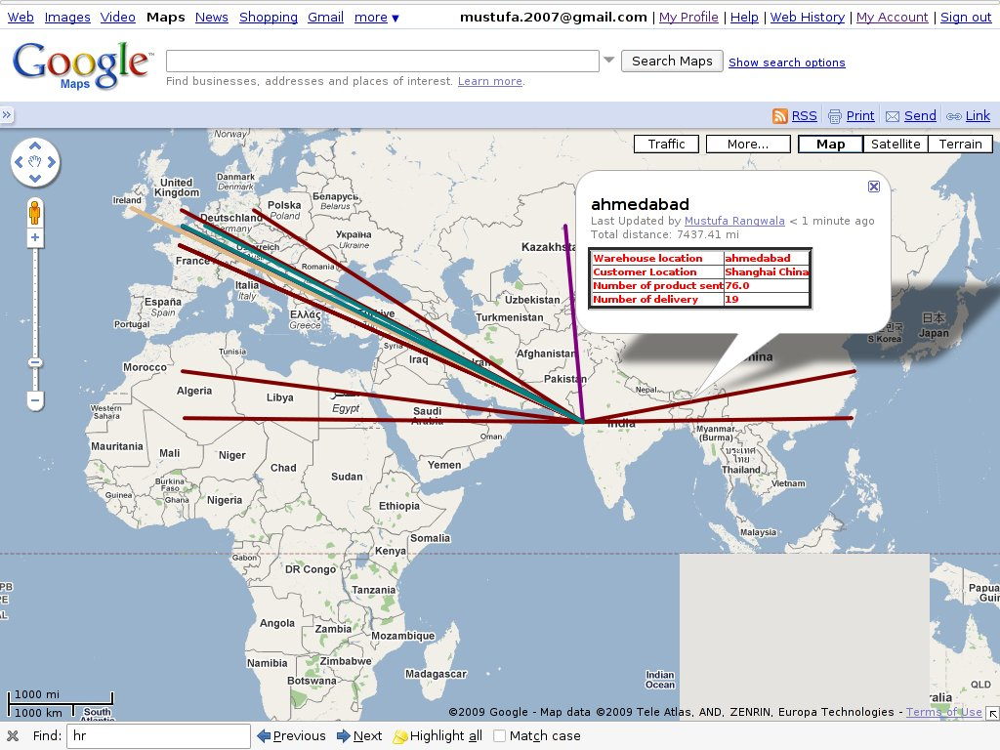

.. i18n: **************
.. i18n: Google Earth
.. i18n: **************
..

**************
Google Earth
**************

.. i18n: Name of module: 
.. i18n: ``google_earth``
..

Name of module: 
``google_earth``

.. i18n: **Features:**
..

**Features:**

.. i18n: 1. See partners information on google map(name, code, address,...) with icon on map
.. i18n: 
.. i18n: 2. And Turnover of country by partners, country appears in light red color => low turnover and with dark red color => high turnover.
.. i18n: 
.. i18n: 3. Delivery routes from Warehouse location to Customer location by cities with 10 different colors (by number of delivery to that city from warehouse).
.. i18n: 
.. i18n: 4. It can create network link kml file for dynamic updates of data on google earth.
.. i18n: 
.. i18n: 5. It can directly open google map in your browser with different information.
.. i18n: 
.. i18n: 6. It generates KML file so you can save it on your computer and upload it on google map/ google earth.
..

1. See partners information on google map(name, code, address,...) with icon on map

2. And Turnover of country by partners, country appears in light red color => low turnover and with dark red color => high turnover.

3. Delivery routes from Warehouse location to Customer location by cities with 10 different colors (by number of delivery to that city from warehouse).

4. It can create network link kml file for dynamic updates of data on google earth.

5. It can directly open google map in your browser with different information.

6. It generates KML file so you can save it on your computer and upload it on google map/ google earth.

.. i18n: **Menus**
..

**Menus**

.. i18n: .. figure::  images/menu_earth.jpg
.. i18n:    :scale: 50
.. i18n:    :align: center
..

.. figure::  images/menu_earth.jpg
   :scale: 50
   :align: center

.. i18n: You can find 5 wizards on Partners/ Google Map/Earth.
..

You can find 5 wizards on Partners/ Google Map/Earth.

.. i18n: **KML File:**
..

**KML File:**

.. i18n: To use the google_earth module you must know what a kml file is and how to use it on google/map.
..

To use the google_earth module you must know what a kml file is and how to use it on google/map.

.. i18n: .. tip::  KML
.. i18n: 
.. i18n:     KML is a file format used to display geographic data in an Earth browser such as Google Earth, Google Maps and Google Maps for mobile. KML uses a tag-based structure with nested elements and attributes and is based on the XML standard. All tags are case-sensitive and must appear exactly as they are listed in the KML Reference. The Reference indicates which tags are optional. Within a given element, tags must appear in the order shown in the Reference.
..

.. tip::  KML

    KML is a file format used to display geographic data in an Earth browser such as Google Earth, Google Maps and Google Maps for mobile. KML uses a tag-based structure with nested elements and attributes and is based on the XML standard. All tags are case-sensitive and must appear exactly as they are listed in the KML Reference. The Reference indicates which tags are optional. Within a given element, tags must appear in the order shown in the Reference.

.. i18n: For more information: 
..

For more information: 

.. i18n: http://code.google.com/apis/kml/documentation/kml_tut.html
..

http://code.google.com/apis/kml/documentation/kml_tut.html

.. i18n: http://code.google.com/apis/kml/documentation/topicsinkml.html
..

http://code.google.com/apis/kml/documentation/topicsinkml.html

.. i18n: http://code.google.com/apis/kml/documentation/kmlreference.html
..

http://code.google.com/apis/kml/documentation/kmlreference.html

.. i18n: **Now How to upload kml file on Google Map:**
..

**Now How to upload kml file on Google Map:**

.. i18n: Step1: go to create map link
..

Step1: go to create map link

.. i18n: Step2: import
..

Step2: import

.. i18n: Step3: upload kml
..

Step3: upload kml

.. i18n: **Difference between Google Maps and Google Earth:**
..

**Difference between Google Maps and Google Earth:**

.. i18n: Google Maps is available through the window of your browser, Google Earth is a downloadable application which can be installed on your computer in order to view the satellite imagery straight from your desktop. However, the super giant Google updates the two products every once in a while so they have almost the same functions
..

Google Maps is available through the window of your browser, Google Earth is a downloadable application which can be installed on your computer in order to view the satellite imagery straight from your desktop. However, the super giant Google updates the two products every once in a while so they have almost the same functions

.. i18n: After uploading KML files to google map look below:
..

After uploading KML files to google map look below:

.. i18n: (1) KML for ``Partner-Country``
..

(1) KML for ``Partner-Country``

.. i18n: .. figure::  images/google_map.jpg
.. i18n:    :scale: 50
.. i18n:    :align: center
..

.. figure::  images/google_map.jpg
   :scale: 50
   :align: center

.. i18n: This is the screen shot which shows the partner's country, turnover of partners reside in that country. Here we can see country wise partners and country wise turnover. By clicking on selected country we can get Number of partners, Number of invoices made and Turnover of the country.
..

This is the screen shot which shows the partner's country, turnover of partners reside in that country. Here we can see country wise partners and country wise turnover. By clicking on selected country we can get Number of partners, Number of invoices made and Turnover of the country.

.. i18n: .. note:: High Turnover => Dark red & Low Turnover => Light red
..

.. note:: High Turnover => Dark red & Low Turnover => Light red

.. i18n: (2) KML for ``Delivery Route``
..

(2) KML for ``Delivery Route``

.. i18n: .. figure::  images/earth_delivery.jpg
.. i18n:    :scale: 50
.. i18n:    :align: center
..

.. i18n: This is the screen shot for finding the delivery routes from warehouse location to customer location. Here we can see there are different routes in different colours. By clicking on particular route we get the information about Customer Location, Warehouse Location, Number of Products sent and Number of deliveries made.
..

This is the screen shot for finding the delivery routes from warehouse location to customer location. Here we can see there are different routes in different colours. By clicking on particular route we get the information about Customer Location, Warehouse Location, Number of Products sent and Number of deliveries made.

.. i18n: (3) KML for ``Partners``
..

(3) KML for ``Partners``

.. i18n: .. figure::  images/partner_map.jpg
.. i18n:    :scale: 50
.. i18n:    :align: center
..

.. figure::  images/partner_map.jpg
   :scale: 50
   :align: center

.. i18n: This is the screen shot showing all partners from different countries. This will make a point on particular partner address on map. By clicking on any point we can get the information about the partner, e.g. Name of partner, Code, Type(customer/supplier), Address, Turnover of Partner, Number of customer invoice, Number of supplier invoice, Total receivable, etc...
..

This is the screen shot showing all partners from different countries. This will make a point on particular partner address on map. By clicking on any point we can get the information about the partner, e.g. Name of partner, Code, Type(customer/supplier), Address, Turnover of Partner, Number of customer invoice, Number of supplier invoice, Total receivable, etc...

.. i18n: (4) Wizard for KML for ``Network link``
..

(4) Wizard for KML for ``Network link``

.. i18n: .. figure::  images/earth_wizard.jpg
.. i18n:    :scale: 50
.. i18n:    :align: center
.. i18n:  
.. i18n: .. tip:: Network link kml: 
.. i18n: 
.. i18n:         A special kind of kml file which has network link tag inside it which contains link of your kml file.
..

.. figure::  images/earth_wizard.jpg
   :scale: 50
   :align: center
 
.. tip:: Network link kml: 

        A special kind of kml file which has network link tag inside it which contains link of your kml file.

.. i18n: This wizard will create network link in kml for different objects and save it to your computer and then you have to upload network link kml to google earth/map. It can update data periodically by looking network link kml files parameters(refreshtime,interval....). For example if you have inserted new partner then google earth can fetch that new partner from webservice of etiny.
..

This wizard will create network link in kml for different objects and save it to your computer and then you have to upload network link kml to google earth/map. It can update data periodically by looking network link kml files parameters(refreshtime,interval....). For example if you have inserted new partner then google earth can fetch that new partner from webservice of etiny.

.. i18n: .. note:: If you ticked partner and country, wizard will create two link tag with url/path of two kml file. Now when you upload this kml file it will show both partner and country information on earth and update that information by given interval time (using url/path ).
.. i18n: 	
.. i18n: 	
.. i18n: **The wizard of network link shown above:**
..

.. note:: If you ticked partner and country, wizard will create two link tag with url/path of two kml file. Now when you upload this kml file it will show both partner and country information on earth and update that information by given interval time (using url/path ).
	
	
**The wizard of network link shown above:**

.. i18n: First, ``path`` shows a url (HTTP address) means your web-client path with port number where your etiny services running.
.. i18n: 	
.. i18n: ``RefreshMode`` specifies a time-based refresh mode, which can be one of the following: 
..

First, ``path`` shows a url (HTTP address) means your web-client path with port number where your etiny services running.
	
``RefreshMode`` specifies a time-based refresh mode, which can be one of the following: 

.. i18n:     onChange - refresh when the file is loaded and whenever the Link parameters change (default).
.. i18n:     
.. i18n:     onInterval - refresh every n seconds (specified in <refreshInterval>).
.. i18n:     
.. i18n:     onExpire - refresh the file when the expiration time is reached.
..

    onChange - refresh when the file is loaded and whenever the Link parameters change (default).
    
    onInterval - refresh every n seconds (specified in <refreshInterval>).
    
    onExpire - refresh the file when the expiration time is reached.

.. i18n: ``RefreshInterval`` indicates to refresh the file every n seconds. 
..

``RefreshInterval`` indicates to refresh the file every n seconds. 

.. i18n: ``ViewRefreshMode`` specifies how the link is refreshed when the "camera" changes.
..

``ViewRefreshMode`` specifies how the link is refreshed when the "camera" changes.

.. i18n:     never(default) - Ignore changes in the view. Also ignore <viewFormat> parameters, if any. 
.. i18n: 		
.. i18n:     onStop - Refresh the file n seconds after movement stops, where n is specified in <viewRefreshTime>. 
.. i18n:         
.. i18n:     onRequest - Refresh the file only when the user explicitly requests it. (For example, in Google Earth, the user right-clicks and selects Refresh in the Context menu.) 
.. i18n:         
.. i18n:     onRegion - Refresh the file when the Region becomes active.
..

    never(default) - Ignore changes in the view. Also ignore <viewFormat> parameters, if any. 
		
    onStop - Refresh the file n seconds after movement stops, where n is specified in <viewRefreshTime>. 
        
    onRequest - Refresh the file only when the user explicitly requests it. (For example, in Google Earth, the user right-clicks and selects Refresh in the Context menu.) 
        
    onRegion - Refresh the file when the Region becomes active.

.. i18n: ``View Refresh Time`` specifies the number of seconds to wait before refreshing the view, after 	camera movement stops.
.. i18n:      
..

``View Refresh Time`` specifies the number of seconds to wait before refreshing the view, after 	camera movement stops.
     

.. i18n: (5) Wizard for Open *Google Map*
..

(5) Wizard for Open *Google Map*

.. i18n: .. figure::  images/open_map.jpg
.. i18n:    :scale: 50
.. i18n:    :align: center
..

.. figure::  images/open_map.jpg
   :scale: 50
   :align: center

.. i18n: This wizard will directly open google map in browser.
..

This wizard will directly open google map in browser.

.. i18n: For example, if you want to open that map for partner-country, then it will directly open google map for partner with countries in browser.
..

For example, if you want to open that map for partner-country, then it will directly open google map for partner with countries in browser.

.. i18n: In above figure, You can see Path field. In that, http://maps.google.com/maps?q=, will be common and later is shown your web-client path with port. Another field is Map For which is selection for Partner, Partner-Country and Delivery-Route. Whatever option you select from Map For field, it will directly open map for that option and with that url(Path).
..

In above figure, You can see Path field. In that, http://maps.google.com/maps?q=, will be common and later is shown your web-client path with port. Another field is Map For which is selection for Partner, Partner-Country and Delivery-Route. Whatever option you select from Map For field, it will directly open map for that option and with that url(Path).

.. i18n: Url looks like ``http://maps.google.com/maps?q=http://yourserver.com:port/kml?model=res.partner`` when you open the browser.
..

Url looks like ``http://maps.google.com/maps?q=http://yourserver.com:port/kml?model=res.partner`` when you open the browser.

.. i18n: .. Copyright © Open Object Press. All rights reserved.
..

.. Copyright © Open Object Press. All rights reserved.

.. i18n: .. You may take electronic copy of this publication and distribute it if you don't
.. i18n: .. change the content. You can also print a copy to be read by yourself only.
..

.. You may take electronic copy of this publication and distribute it if you don't
.. change the content. You can also print a copy to be read by yourself only.

.. i18n: .. We have contracts with different publishers in different countries to sell and
.. i18n: .. distribute paper or electronic based versions of this book (translated or not)
.. i18n: .. in bookstores. This helps to distribute and promote the OpenERP product. It
.. i18n: .. also helps us to create incentives to pay contributors and authors using author
.. i18n: .. rights of these sales.
..

.. We have contracts with different publishers in different countries to sell and
.. distribute paper or electronic based versions of this book (translated or not)
.. in bookstores. This helps to distribute and promote the OpenERP product. It
.. also helps us to create incentives to pay contributors and authors using author
.. rights of these sales.

.. i18n: .. Due to this, grants to translate, modify or sell this book are strictly
.. i18n: .. forbidden, unless Tiny SPRL (representing Open Object Press) gives you a
.. i18n: .. written authorisation for this.
..

.. Due to this, grants to translate, modify or sell this book are strictly
.. forbidden, unless Tiny SPRL (representing Open Object Press) gives you a
.. written authorisation for this.

.. i18n: .. Many of the designations used by manufacturers and suppliers to distinguish their
.. i18n: .. products are claimed as trademarks. Where those designations appear in this book,
.. i18n: .. and Open Object Press was aware of a trademark claim, the designations have been
.. i18n: .. printed in initial capitals.
..

.. Many of the designations used by manufacturers and suppliers to distinguish their
.. products are claimed as trademarks. Where those designations appear in this book,
.. and Open Object Press was aware of a trademark claim, the designations have been
.. printed in initial capitals.

.. i18n: .. While every precaution has been taken in the preparation of this book, the publisher
.. i18n: .. and the authors assume no responsibility for errors or omissions, or for damages
.. i18n: .. resulting from the use of the information contained herein.
..

.. While every precaution has been taken in the preparation of this book, the publisher
.. and the authors assume no responsibility for errors or omissions, or for damages
.. resulting from the use of the information contained herein.

.. i18n: .. Published by Open Object Press, Grand Rosière, Belgium
..

.. Published by Open Object Press, Grand Rosière, Belgium
