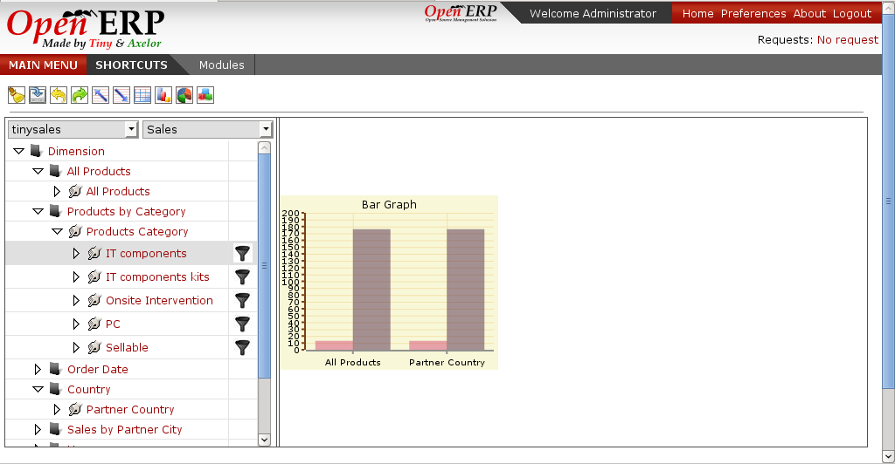

Graphs
======

Graphs presents the grid output on the graphs or graphical way by plotting on the axis. 

Lets take the case:

.. image::  images/data_browser10.png
   :scale: 65

For the above grid when we will generate graph it will be:

When we have children expanded for the one element on the axis and the other is not drilled. There will be two graph to show the same

.. image::  images/data_browser17.png
   :scale: 65
