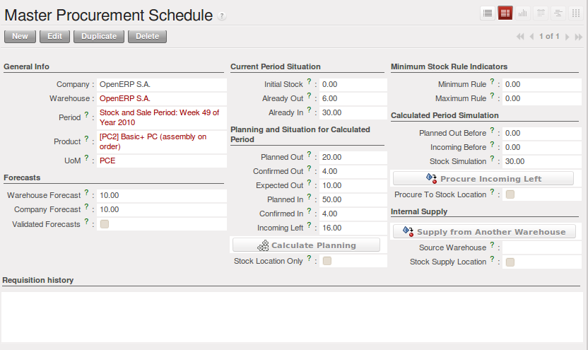

Estimating Delivery Dates
=========================

Standard Delivery Time
----------------------

In order to define the delivery time, you have to know three things:

* Customer Lead Time : 

  That is the time you promise to your customer for a delivery. It corresponds to the average delay
  between the confirmation of the customer order and the delivery of the finished goods. It can be
  defined in the product form, in the :guilabel:`Procurement and Locations` tab.
  
  This time will be influenced by the Manufacturing Lead Time and the Delivery Lead Time.
  
* Manufacturing Lead Time :

  This is the time you need to produce one unit of a product. If this product needs other sub-products,
  the different manufacturing times will be summed. It can also be defined in the product form, in the 
  :guilabel:`Procurement and Locations` tab.
  
* Delivery Lead Time :

  This is the time your supplier needs to deliver the goods. This delay can be defined in the product form
  in the :guilabel:`Suppliers` tab.
  
For example, if we have to deliver some products to a customer in a month (in 30 days). You promise to deliver
the goods to the customer within 10 days, the manufacturing time is equal to 4 days and our suppliers deliver 
the raw materials within 3 days.

According to those numbers, we will have to start the process in 23 days if we have to order raw materials.
    
Schedule Logistic Flows according to MRP1 Rules 
-----------------------------------------------

MRP is a software-based production, planning and inventory control system used to manage the manufacturing process.

It is a computer-based system in which the given Master Schedule is exploded with Bills Of 
Material, into the required amount of raw material, parts and subassemblies needed to produce 
the final products in each period.

Incoming and Outgoing Products Planning
========================================

To be able to plan incoming and outgoing shipments of products, you have to install the module
:guilabel:`stock_planning`. 

	
	*Planning the Deliveries of Customer Products*

Thanks to this module, you will be able to calculate a planning of the stock for a product.

Planned dates on a packing order are put in each stock move line. If you have a packing order 
containing several products, not all of the lines necessarily need to be delivered the same day. 
The minimum and maximum dates in a packing order show the earliest and latest dates on the stock 
move lines for the packing.

If you move a packing order in the calendar view, the planned date in the stock move lines will 
automatically be moved as a result.

Managing Inventory Reconciliation
=================================

Inventory reconciliation involves two steps: physical and accounting.

Physical inventory steps include taking a written inventory record and comparing it to the actual 
goods in the company’s warehouses. Counting obsolete and damaged products is also a reconciliation 
activity. 

Reconciliation steps on the accounting side include verification that all inventory purchases are 
posted, entering adjustments from the physical count and analysing the dollar differences between months.
Inventory reconciliation frequency depends on the size, location, and type of inventory in a company’s 
operations.

Building Reports to Track Activity 
==================================

With OpenERP, you can build your own reports in order to track the different activities in your warehouses.
To create your own reports, you have to install the :guilabel:`base_report_creator`. It will add a 
submenu in :menuselection:`Administration --> Customization --> Reporting`.

.. figure:: images/report_creation.png
	:scale: 75
	:align: center
	
	*Create your Own Reports*

This newly added section allows you to define for your new report:

* The general configuration:

  The aim of this tab is to choose the models your report will rely on.

* The view parameters
  
  This tab will define the display of your report. You can choose between the traditional available views
  (Tree/List, Form, Graph and Calendar) and you can define three different ways to display your report.

* The fields to display

  The fields available to display will depend on the models you choose in the :guilabel:`General Configuration`
  tab.
  
  When you add a new field to your report, different fields have to be specified:
  
  * Sequence - defines the order in which the fields will be displayed in the report
  * Field - the information you want to display in your report
  * Grouping method - affects the way the field is displayed. You can choose between *Grouped*, *Sum*,
    *Minimum*, *Count*, *Maximum* and *Average*
  * Graph mode - defines which axe of the graph the field will represent
  * Calendar mode - defines the meaning of the field for the calendar (*Starting or Ending date*,
    *Delay*, *End Date*, *Unique Colours*)

* The filters on fields

  This tab will let you choose which data to display according to the value of a field. It is possible to 
  manually modify or add new filters according to your needs.

* The security
  
  The security tab is used to select the groups that are able to display the report.
  
.. tip:: Create Report with OpenOffice
   
   You can also create or edit reports with OpenOffice using the :guilabel:`base_report_designer`
   module.
   
   In order to add the extension to OpenOffice, load this module and start the configuration. A new 
   window will ask you to *Save As* a file that contains the extension. 
   
   Once you have saved the file, start OpenOffice and go to :menuselection:`Tools --> Extension Manager`, 
   then click Add and select the previously saved file. Restart OpenOffice.org and now you have the
   extension installed.
   
   .. figure:: images/report_creator_openoffice.png
   		:scale: 50
   		:align: center
   		
   		*Extension to Create a Report in OpenOffice*
   		

.. Copyright © Open Object Press. All rights reserved.

.. You may take electronic copy of this publication and distribute it if you don't
.. change the content. You can also print a copy to be read by yourself only.

.. We have contracts with different publishers in different countries to sell and
.. distribute paper or electronic based versions of this book (translated or not)
.. in bookstores. This helps to distribute and promote the OpenERP product. It
.. also helps us to create incentives to pay contributors and authors using author
.. rights of these sales.

.. Due to this, grants to translate, modify or sell this book are strictly
.. forbidden, unless Tiny SPRL (representing Open Object Press) gives you a
.. written authorisation for this.

.. Many of the designations used by manufacturers and suppliers to distinguish their
.. products are claimed as trademarks. Where those designations appear in this book,
.. and Open Object Press was aware of a trademark claim, the designations have been
.. printed in initial capitals.

.. While every precaution has been taken in the preparation of this book, the publisher
.. and the authors assume no responsibility for errors or omissions, or for damages
.. resulting from the use of the information contained herein.

.. Published by Open Object Press, Grand Rosière, Belgium
