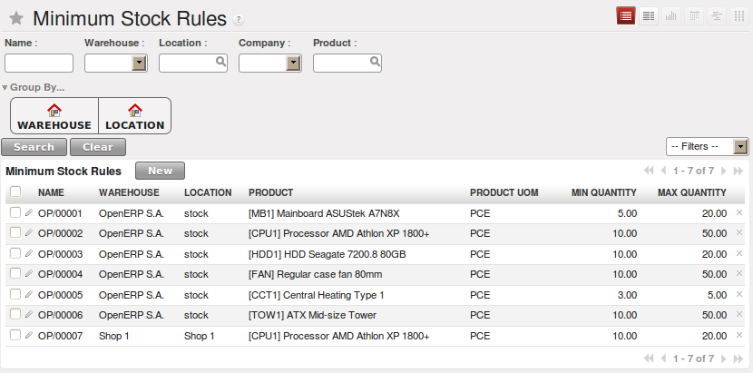

Managing Physical Inventory Structure
=====================================

.. index::
	single: Stock; Warehouse
	
Warehouse
---------

Warehouses are designed for physical locations from which you can deliver to the customer, and to which you
receive raw materials. When you buy products from a supplier, you should take account of the Warehouse you use
for this purchase. This also enables the end user to not have to choose from a list of locations, but simply a
real warehouse.
Use the menu :menuselection:`Warehouse --> Configuration --> Warehouse Management --> Warehouses`, then click New to 
configure a new warehouse.

A warehouse is defined by a link between three locations:

* The :guilabel:`Location Stock` field shows the place of products available for delivery to a customer directly from
  this warehouse. Availability is given by all the products in that location and any child locations.

* The :guilabel:`Location Input` field shows where ordered products are received from a supplier in that warehouse. It
  can be the same as the stock location if, for example, you want to do a quality control operation on
  your incoming raw materials.

* The :guilabel:`Location Output` field (called ``Output`` in the demonstration database) is designed as a buffer zone
  in which you store all the items that have been picked, but not yet delivered to a customer. You are
  strongly advised not to put this location within the stock hierarchy but instead at a higher level or at the same level.
  
.. figure:: images/stock_warehouse.png
	:scale: 75
	:align: center
	
	*Warehouse Parameters*
  
You can also set an address for the warehouse. This address should ideally be an address of your company. Once
the warehouse has been defined, it can be used in:

* Minimum stock rules,

* Supplier orders,

* Customer orders (using the definition of a point of sale, which is linked to a warehouse).

Automatic Procurement
^^^^^^^^^^^^^^^^^^^^^

Several methods of automatically procuring products can be carried out by OpenERP:

* the workflow used by products that have the procurement method *Make to Order*,

* using minimum stock rules for *Make to Stock* products,

* using the master production schedule for *Make to Stock* products.

The last two methods are described below.

Minimum Stock Rules
^^^^^^^^^^^^^^^^^^^

To automatically make stock replenishment proposals, you can use minimum stock rules. Go to the menu
:menuselection:`Warehouse --> Automatic Procurements --> Minimum Stock Rules`.

The rule is the following: if the virtual stock for the given location is lower than the minimum stock indicated in
the rule, the system will automatically propose a procurement to increase the level of virtual stock to the
maximum level given in the rule.

	
	*List of Minimum Stock Rules*
	
.. tip:: Conflict Resolution

   You may find draft production or procurement orders to be created although they should not exist.
   That can happen if the system is badly configured (for example, if you have forgotten to set the
   supplier on a product).

   To check this, look at the list of procurements in the exception state in the menu
   :menuselection:`Warehouse --> Schedulers --> Procurement Exceptions`. More
   details about processing these exceptions is given in :ref:`ch-mnf`.

We underline that the rule is based on *virtual* quantities and not just on real
quantities. It takes into account the calculation of orders and receipts to come.

Take the following example:

* Products in stock: 15

* Products ordered but not delivered: 5

* Products in manufacturing: 2

The rules defined are:

* Minimum stock: 13

* Maximum stock: 25.

Once the rules have been properly configured, the purchasing manager only needs to look at the list
of orders for confirmation with the supplier using the menu :menuselection:`Purchases --> Purchase Management -->
Requests for Quotation`.

.. note:: Procurement

   Note that the procurement does not require that you buy from a supplier. If the product has a
   :guilabel:`Supply Method` ``Produce``, the scheduler will generate a Manufacturing order instead of a
   supplier order.

You can also set multiple quantities in the minimum stock rules. If you set a multiple quantity of 3
the system will propose procurement of 15 pieces, and not the 13 it really needs. In this case, it
automatically rounds the quantity upwards.

.. note:: Maximum Quantity

	Pay attention to the fact that the maximum quantity is not the maximum you will have in stock. 
	If we take the following situation: a company has 10 pieces of product with minimum stock rules defined 
	for this product by `Min quantity = 10`, `Max quantity = 30` and `Qty multiple = 12`. If an order of 2 
	pieces comes, a purchase of 24 pieces order will be executed. The first 12 pieces will be ordered to reach
	the minimum quantity and the other 12 to reach the maximum quantity. At the end, the stock of this product 
	will be equal to 32 pieces.

In a minimum stock rule, when you indicate a warehouse, it suggests a stock location by default in
that warehouse. You can change that default location when the scheduler completes.

.. index::
	single: Stock; Location
	
Location
--------

A location is one component of the warehouses that is used to managed all types of storage places, such as at the 
customer's and production counterparts.

There are different types of locations that allow you to structure your warehouses according to your needs.
Locations are structured hierarchically to account for the subdivision of a warehouse into sections, aisles, and/or
cupboards. The hierarchical view also enables you to structure virtual locations such as production counterparts.
That gives you a finer level of analysis.
Go to the menu :menuselection:`Warehouse --> Configuration --> Warehouse Management --> Locations`, then click New 
to define new locations.

.. figure:: images/stock_location_form.png
	:scale: 75
	:align: center
	
	*Defining a new Stock Location*

Here are the different available types of locations:

.. index::
   single: Stock; Location types
   
* ``Supplier Location``: virtual location representing the source location for products received from suppliers,

* ``View``: shows that the location is only an organizational node for the hierarchical structure, and
  cannot be involved in stock moves itself. The view type is not made into a leaf node in a
  structure – it usually has children.
  
* ``Internal Location``: physical location inside your own stock,

* ``Customer Location``: virtual location representing the destination for products sent to customers,

* ``Inventory``: virtual location serving as the counterpart for inventory operations used to correct stock levels (physical inventories),

* ``Procurement``: virtual location serving as temporary counterpart for procurement operations when you do not yet know the source (supplier or production). Products in this location should be zero after the scheduler run
  completes,
  
* ``Production``: virtual counterpart location for production operations; consuming raw material and sending
  finished products,

* ``Transit Location for Inter-Companies Transfers``: used as an intermediate location in a multi-company environment.

You can have several locations of the same type. In that case, your product, supplier and warehouse configurations
determine the location that is to be used for any given operation.

Location Addresses
^^^^^^^^^^^^^^^^^^
Each location can have a specific address that enables you to create a location for a customer or a supplier, for
example. You can then give it the address of that customer or supplier. Go to the partner form to tell OpenERP it should use this location rather than the default location given to partner deliveries.

.. tip:: Subcontracting Production

	You will see in the on line chapter Manufacturing that it is possible to assign a location to a manufacturing workcenter.
	If this location is at a supplier’s, you must give it an address so that OpenERP can prepare a delivery order for
	the supplier and a receive operation for the manufactured goods.
	Creating a location specifically for a partner is also a simple solution for handling consigned stocks in OpenERP.

.. note:: Consigned Stock

	Consigned stock is stock that is owned by you (valued in your accounts), but is physically stocked by your supplier.
	Or, conversely, it could be stock owned by your customer (not valued by you), but stocked in your company. Make sure
	that you create consignment locations as part of your internal stock.

To enable you to easily consolidate at a higher level, the location definition is hierarchical. This structure is
given by the field ``Parent Location``. That also enables you to manage complex cases of product localization.

For example, you could imagine the following scenario: **One Company with Two Warehouses**

A company has a warehouse in Paris and in Bordeaux. For some orders, you have to deliver the products from Paris,
and for others from Bordeaux. But you should also specify a fictitious warehouse that OpenERP uses to calculate
whether it should deliver products from Paris or from Bordeaux.
To do this in OpenERP, you would create a third warehouse ‘France’ which consolidates the warehouses in Paris
and Bordeaux. You create the following physical locations:

* Company

  * Output

    * Warehouses France

      * Warehouse Paris

      * Warehouse Bordeaux			
			
OpenERP will then deliver the goods from the warehouse that has the ordered product in stock. When products
are available in several warehouses, OpenERP will select the nearest warehouse. To formalize the notion of
distance between warehouses you should use the geographic co-ordinates (X, Y, Z) of the different stores to
enable OpenERP to search for the nearest goods.
The same co-ordinates could also be used to structure the shelves, aisles and interior rooms in a warehouse.

Linked Locations
^^^^^^^^^^^^^^^^

Locations in OpenERP can be linked between each other to define paths followed by products. So you can define
rules such as: all products that enter the warehouse should automatically be sent to quality control. The warehouse
and quality control are represented by two different locations.

Then when a product arrives in a location, OpenERP can automatically suggest that you send the product to
another linked location. Three link modes are available:

* Manual Operation,
* Automatic Move,
* Automatic No Step Added.

The *Manual Operation* mode will create an internal move order to the linked location once products arrive in the
source locations. This order will wait for a confirmation of the move by a user. This enables you to have a list of
moves to do, proposed by the system and confirmed by the storesperson. 

The *Automatic Move* mode will do the same, but will not wait for a confirmation from the user. Products will automatically be sent to the linked location without any intervening manual operation to do. This corresponds to the case where, for simplicity, you delete a step in the process so the end user can set off the process automatically.

The *Automatic No Step Added* mode will not include the additional stock move, but will change the destination
move transparently to assign the linked location. You could then assign a destination location to which you
send all the products that arrive in your warehouse. The storesperson will modify the goods receipt note.

.. tip:: Product Logistics

	The module ``stock_location`` lets you generate paths to follow, not just at the level of locations, but also at the
	level of products. It then enables you to manage default locations for a given product or to refer to the products
	as a function of operations such as quality control, supplier receipt, and after-sales service.
	
	A more detailed explanation of this module, with examples, is given at the end of this chapter.
	
If there is linking to do, the **Chained Location Type** field allows you to determine the destination location. If the field
is set to ‘Customer’, the location is given by the properties of the partner form. If the field is set to `fixed`, the
destination location is given by the field **Chained Location If Fixed**.

Some operations take a certain time between order and execution. To account for this lead time, you can set a
value in days in the field **Chaining Lead Time**. Then the extra move (automatic or not) will be carried out several
days after the original move. If you use the mode *Automatic No Step Added*, the lead time is inserted directly into
the initial order. In this way, you can add security lead times at certain control points in the warehouse.

Structuring Locations
^^^^^^^^^^^^^^^^^^^^^

In the next part, you will see that by linking locations you can manage a whole series of complex cases for efficient production management:

* Handling multiple operations for a customer order,
* Tracking import and export by sea transport,
* Managing a production chain in detail,
* Managing rented products,
* Managing consigned products.

To show these concepts, different cases of structuring and configuring these locations are given below. Many other
configurations are possible according to company needs.

Examples:

* **Handling customer orders**

Customer orders are usually handled in one of two ways:

	* item note (or preparation order), confirmed when the item is ready to send,
	* delivery order (or freight note), confirmed when the transporter has delivered the item to a customer.
	
You use the following stock move in OpenERP to simulate these operations:

	* Packing Note: Stock > Output,
	* Delivery Order: Output > Customer.
	
The first operation is automatically generated by the customer order. The second one is generated by the stock management,
showing that the Output location is linked to the Customer location. The two operations will be displayed in *Waiting* status. If the 
Output location is not situated beneath the stock location, you then have to move the item from stock to the place where
the item is prepared.

Some companies do not want to work in two steps, because it just seems like extra work to have to confirm a
delivery note in the system. You can then set the link mode to ‘Automatic’ to make OpenERP automatically
confirm the second step. It is then assumed all the items have automatically been delivered to the customer.

* **Linked production**

The :mod:`stock_location module` enables you to manage the linkages by product in addition to doing that by
location. You can then create a location structure that represents your production chain by product.

The location structure may look like this:

* Stock

  * Level 1
  
  * Level 2
  
	* Link 1
	
	  * Operation 1
	  
	  * Operation 2
	  
	  * Operation 3
	  
	  * Operation 4
			
You can then set the locations a product or a routing must go through in the relevant form. All products that enter
the production chain will automatically follow the predetermined path.
You can see the location structure using :menuselection:`Warehouse --> Inventory Control --> Location Structure`.

    
Shop
----

The counterparts for procurement, inventory and production operations are given by the locations shown in the
product form. The counterparts of reception and delivery operations are given by the locations shown in the
partner form. The choice of stock location is determined by the configuration of the warehouse, linked to a Shop,
which can be defined using :menuselection:`Sales --> Configuration --> Sales --> Shop`.

Once a shop is defined, you will be able to make sales orders from this shop. You need at least one shop in order to be able to make sales orders.

Stock
-----

In the Product form, the ``Stock by Location`` action will give you the stock levels of the various products in any selected location. If you have not selected any location, OpenERP calculates stocks for all of the physical locations. When you are in the Stock by Location view, click the Print button to print the Location Content or the Location Inventory Overview reports.

.. note:: Availability of Stock

	Depending on whether you look at the product from a customer order, or from the menu of a product form, you
	can get different values for stock availability. If you use the Product menu, you get the stock in all of the
	physical stock locations. Looking at the product from the order you will only see the report of the warehouse 
	selected in the order.

In this respect, two important fields in the product form are:

* Real Stock: Quantity physically present in your warehouse,

* Virtual Stock: Calculated as follows: real stock – outgoing + incoming.

.. note:: Virtual Stock

	Virtual stock is very useful because it shows what the salespeople can sell. If the virtual stock is higher than
	the real stock, this means products will be coming in. If virtual stock is smaller than real stock, certain 
	products are reserved for other sales orders or work orders.

.. tip:: Detail of Future Stock

	To get more details about future stock, you can click ``Stock Level Forecast`` to the right of the product form to 
	get the report Forecast Stock Levels as illustrated below. OpenERP shows a graph of the changes in stock 
	in the days to come, varying as a function of purchase orders, confirmed production and sales orders.
	
.. figure:: images/stock_forecast_report.png
	:scale: 75
	:align: center
	
	*Printout of forecast stock levels*

.. tip:: Filter Stock by Location

	By default, in Product list view, the columns Real Stock and Virtual Stock show the stock figures for all stock
	locations where a product is stored. Use the `Extended Filters` to enter a specific stock location, if you want to 
	only see the stock in a specific location.

Lead Times and Locations
^^^^^^^^^^^^^^^^^^^^^^^^

The tab **Procurement & Locations** in the Product form contains information about different lead times and
locations. Three lead time figures are available:

* **Customer Lead Time**: lead time promised to the customer, expressed in number of days between the order
  and the delivery to the customer,
  
* **Manufacturing Lead Time**: lead time, in days, between a production order and the end of production of
  the finished product,
  
* **Warranty (months)**: length of time in months for the warranty of the delivered products.

.. note:: Warranty

	The warranty period is used in the `Repairs management and after-sales service`. You can find more information
	on this subject in the on line chapter about Manufacturing.

Fields in the section *Storage Localisation* are for information only; they do not have any impact on the management
of stock.

*Counter-Part Locations Properties* are automatically proposed by the system, but the different values can be
modified. You will find counterpart locations for:

* Procurement,

* Production,

* Inventory.

A procurement location is a temporary location for stock moves that have not yet been finalized by the scheduler.
When the system does not yet know if procurement is to be done by a purchase or production, OpenERP uses the
counterpart location Procurement. In this location, you will find everything that has not yet been planned by the
system. The quantities of product in this location cancel each other out.

Initial Inventory
^^^^^^^^^^^^^^^^^

Once a product has been defined, use an initial inventory operation to put current quantities into the system by
location for the products in stock. Go to the menu :menuselection:`Warehouse --> Inventory Control --> Physical 
Inventories` to do your initial inventory.

.. figure:: images/stock_inventory_new.png
	:scale: 75
	:align: center
	
	*Defining a New Inventory Operation*

Give a name (for example Initial Inventory or Lost Product XYZ ) and a date (proposed by default)
for each inventory operation.

You have three ways of doing an inventory.

* Click the Import Inventory action and select the location concerned. You can choose to include child locations 
  and set the inventory to zero (especially useful to ensure the count is done correctly).
  
* You can update the inventory from the Product form. Go to the Information tab, Stocks section, and click
  the Update button. On confirmation, OpenERP will create a Physical Inventory.
  
* You can manually add inventory lines. You can then enter data about the quantities available for each product 
  by location. Start by entering the location, for example Stock , and then select the product.
  OpenERP automatically completes the quantity available for that product in the location shown. You can
  then change that value to correct the value in stock.

Enter data for a single line in your inventory:

* Location : Stock,
* Product : PC1 Basic PC,
* Quantity : 23 Units.

When your inventory operation is finished, you can confirm it using the Confirm Inventory button to the bottom
right of the form. OpenERP will then automatically create the stock moves to close the gaps, as mentioned at the
start of this chapter. You can verify the moves generated using the Posted Inventory tab of the inventory operation
form.

The correct levels of your product are now in your stock locations. A simple way of verifying this is to reopen the
product form to see the quantities available in stock.

.. tip:: Periodical Inventory

	You are usually legally required to do a stock check of all your products at least once a year. As well as doing a
	complete annual stock check, OpenERP also supports the method of periodical inventory.
	
	That means you can check the stock levels of a proportion of your products every so often. This system is accepted
	in France as long as you can guarantee that all of your products have been counted at least once per year. To see
	the last inventory count per product, use the report :menuselection:`Warehouse --> Reporting --> Last Product 
	Inventories`.
	
	You can do this the same way for all products and all locations, so you only carry out small inventory operations
	through the year, rather than a single large stock check at one point in the year (which usually turns out to be at
	an inconvenient time).

.. Copyright © Open Object Press. All rights reserved.

.. You may take electronic copy of this publication and distribute it if you don't
.. change the content. You can also print a copy to be read by yourself only.

.. We have contracts with different publishers in different countries to sell and
.. distribute paper or electronic based versions of this book (translated or not)
.. in bookstores. This helps to distribute and promote the OpenERP product. It
.. also helps us to create incentives to pay contributors and authors using author
.. rights of these sales.

.. Due to this, grants to translate, modify or sell this book are strictly
.. forbidden, unless Tiny SPRL (representing Open Object Press) gives you a
.. written authorisation for this.

.. Many of the designations used by manufacturers and suppliers to distinguish their
.. products are claimed as trademarks. Where those designations appear in this book,
.. and Open Object Press was aware of a trademark claim, the designations have been
.. printed in initial capitals.

.. While every precaution has been taken in the preparation of this book, the publisher
.. and the authors assume no responsibility for errors or omissions, or for damages
.. resulting from the use of the information contained herein.

.. Published by Open Object Press, Grand Rosière, Belgium

