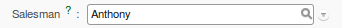

.. index::
   pair: data; import
   pair: data; export

Importing and Exporting Data
============================

Every form in OpenERP has a standard mechanism for importing data from a CSV file through the client user interface. 
That is the same format as used in the language translations.

.. note:: Forms and Lists

   You have access to the Import and Export functions in the web client on a single form view in read-
   only mode – you cannot reach Import or Export in any other view or when the form is editable.
   If you are using the GTK client, you can find the functions from the top menu 
   :menuselection:`Form --> Import data...` and :menuselection:`Form --> Export data...`.

The CSV file format is a text format compatible with most spreadsheet programs (such as OpenOffice
Calc and Microsoft Excel), and is easily editable as a worksheet. The first line contains the name of
the field in the form. All the subsequent lines are data, aligned in their respective columns.

.. index::
   pair: data; CSV export

Exporting OpenERP Data to CSV
-----------------------------

Start exploring OpenERP's use of the CSV format by exporting a modestly complex set of data,
the partners and partner addresses in the demonstration data.

Go to :menuselection:`Sales --> Address Book --> Customers` for a list of partners, and select the records to export by clicking the checkbox on the left of each record. Then look for the :guilabel:`Other Options` section on the right of the list and click the :guilabel:`Export` link. This pops up the :guilabel:`Export Data` dialog box.
Select the following fields:

* :guilabel:`Name`,

* :guilabel:`Contact Name` under the :guilabel:`Contacts` menu,

* :guilabel:`City` under the :guilabel:`Contacts` menu.

You can either select and add them one at a time, or :kbd:`Ctrl-click` them and add
the multiple selection - the order in which you 
select them, is the order in which they will be displayed.

If you do not wish to export your data just yet, or would like to use the same fields for future exports,
you have the option to save these settings. To do that, click :guilabel:`Save List` and give your export a name.

Then click :guilabel:`Export` and save the resulting :file:`data.csv` file somewhere accessible - 
perhaps your desktop. You can open that file in a spreadsheet program or a text editor.

You will see that you have a list of partners, with the name and city of each partner's contacts
alongside. In the couple of cases where there is more than one address, the partner name
is left out. So it is important to note that the order of entries is critical - do not sort
that list!

.. tip:: List Limits

   There is a limit to the number of items you can export in the clients - it is the number
   you can actually see, and that is 20 items by default in the web client, but is
   arbitrary in the GTK client.
   
   You can change the number of items viewed by clicking on the link which shows the count of the items.
   You can then make a selection of limiting it to a fixed number of items at a time, for example, 50 or 100,
   or you can choose to view unlimited number of items at a time.

.. index::
   pair: data; CSV import

Importing CSV Data to OpenERP
-----------------------------

Use this export file as a template for an import file by deleting all of the data,
and using new data (here you will just import new data alongside the demonstration data,
but the principle is the same for a blank database).

For example, to import partners with several contacts for which you specify a name and a city, you
would create the following CSV file from the export file:

.. csv-table:: Example of importing partner address fields
   :header: "Name", "Contacts/Contact Name", "Contacts/City"
   :widths: 12,10,8

   "Whole Globe Technologies","Graham Global","Athens"
   "","Wanda World","Rome"
   "","Emerson Earth","New York"
   "Miles A Minute","",""

From the list of partners, click the :guilabel:`Import` button, and then in the 
:guilabel:`Import Data` window click :guilabel:`Browse` to search for and import
the new :file:`data.csv` file. The web client automatically matches column names
but the GTK client requires that you click the :guilabel:`Auto detect` button.
You can use the default :guilabel:`Options` or change them according to preference.
Then click :guilabel:`Import`.

You will get a dialog box showing that you have imported 2 objects, and you can
see the new partners and partner addresses when you refresh the list on-screen.

.. index::
   pair: data; CSV structured

The CSV Format for Complex Database Structures
----------------------------------------------

When you import data, you have to overcome the problem of representing a database structure in \
``.csv``\  flat files. To do this, two solutions are possible in OpenERP:

* importing a CSV file that has been structured in a particular way to enable you to load several
  different database tables from a single file (such as partners and partner contacts in one CSV
  file, as you have just done above),

* importing several CSV files, each corresponding to a specific database table, that have explicit
  links between the tables.

.. note:: Server-side Importing

   You can also import CSV data through the server interface. The file format is the same, but
   column headings differ slightly. When importing through the user interface, it checks that the column
   heading names match the names seen in the forms on the user interface itself. 
   In contrast, when importing through the 
   server, the column heading names must match the internal names of the fields.

Start by building the header of the CSV file. Open the import tool on the object that you are
interested in, and select the fields that you want to import into your OpenERP database. You must
include every field that is colored blue because those fields are required (unless you know that they
get filled by default with an appropriate value), and also any other field that is important to you.

.. figure::  images/csv_column_select.png
   :scale: 75
   :align: center

   *Selecting fields to import using a CSV file*

Use the field names as the column names in the first line of your CSV file, adding one field per
column. If your CSV file has these names in the first line, then when you import your CSV file,
OpenERP will automatically match the column name to the field name of the table. When you have
created your CSV file, you will do that by clicking the :guilabel:`Nothing` button to clear the
:guilabel:`Fields to Import`, then select your CSV file by browsing for a :guilabel:`File to
import`, and then clicking the :guilabel:`Auto Detect` button.

To import CSV data that matches your database structure, you should distinguish between the following types
of fields in the OpenERP interface:  *many-to-many*  fields (between multiple sources and
destinations),  *many-to-one*  fields (from multiple sources to a single destination), and
*one-to-many*  fields (from a single origin to multiple destinations).

.. note:: Foreground Table

   Each of these types is described in relation to a foreground table –
   the table whose entry form you are viewing and whose entries would be updated by a simple CSV file.

   Just because one of these relation fields appears on the foreground table, does not mean that there
   is an inverse field on the related table – but there may be.

   So there is *no* one-to-many field in the User form to reflect the many-to-one :guilabel:`user_id` Salesman field in
   the Customer form,
   but there *is* a many-to-one :guilabel:`partner_id` Partner Name field in the Addresses form to reflect the one-to-many
   :guilabel:`child_ids` Partner Contacts field in the Customer form.

Have a look at the screenshots below to see the differences.

   *A many-to-one field: a salesperson linked to a partner*

.. figure::  images/csv_many2many.png
   :scale: 75
   :align: center

   *A many-to-many field: partner categories*

.. figure::  images/csv_one2many.png
   :scale: 75
   :align: center

   *A one-to-many field: partner contacts*

All of the other fields are coded in the CSV file as just one text string in each column.

.. index:: 
   pair: relation; field

Many-to-one Fields
^^^^^^^^^^^^^^^^^^

Many-to-one fields represent a relationship between the foreground table and another table in the
database, where the foreground table has a single entry for the other table. OpenERP tries to link 
the new record in the foreground table with the field in the other table by matching the field values.

.. tip:: Field Identifiers 

   If you are working on the server side, you can use identifiers rather than the names of resources
   to link tables. To do this, you import the
   first file (for example, Products) with a column named :guilabel:`id` in your CSV file that contains a
   unique identifier for each product. This could be an incrementing number.

   When you import other files which link to the first table, you can use the identifier in preference
   to the names (so, for example, when you are saving inventory you can use \ ``product:id`` \
   instead of the product name). 
   You then do not need any complex conversion to create links between the two tables.
   
   This considerably simplifies the importation of another database into OpenERP.
   You just create a linking ``id`` column for each table that you are importing
   that contains the identifier used in the first table.

Many-to-many Fields
^^^^^^^^^^^^^^^^^^^

Many-to-many fields are handled just like many-to-one fields in trying to recreate the relationship
between tables: either by searching for names or by using identifiers.

There are several possible values in a single many-to-many field. Therefore a partner can be given
several associated categories. You must separate the different values with a comma.

One-to-many Fields
^^^^^^^^^^^^^^^^^^

One-to-many fields are a bit different. Take as an example the :guilabel:`Partner Contacts` field in
the Customer form, which contains all of the linked contacts.

To import such a field you do not have to link to an existing entry in another table, but can instead
create and link to several partner contacts using the same file. You can then specify several values
for different fields linked to that object by the one-to-many field. Each field must be put in a
column of the table, and the title of that column must be expressed in the form \ ``field_one-to-
many/field_linked-object`` \. The partner data you imported earlier took that form.

.. note::  Symmetry in Relation Fields

	Depending on the structure of your data, it can be easier to use the one-to-many form or the
	many-to-one form in relating two tables, so long as the relevant fields exist on both ends of the relationship.

	For example, you can:

	* import one partner with different contacts in a single file (one-to-many),

	* import the partners first, and then the contacts with the field linking to the partner in a many-to-one form.

.. index::
   single: data; import example

Another Example of a CSV Import File
------------------------------------

To illustrate data importing, you can see another example below. First import partner
categories, and then import some partners and their contacts along with links to the categories
just created. Although you can create new contacts at the same time as creating partners (because
you can do this for *one-to-many* relations), you cannot create new categories this way (because they
use *many-to-many* relations). You must create new categories in a separate step.

Partner Categories
^^^^^^^^^^^^^^^^^^
Start by creating partner categories in a CSV file:

#. Create the following table in your spreadsheet program:

   .. csv-table:: Partner categories file
      :header: "","Column A","Column B"
      :widths: 5,10,10

      "Line 1","Category Name","Parent Category"
      "Line 2","Quality",""
      "Line 3","Gold","Quality"
      "Line 4","Silver","Quality"
      "Line 5","Bronze","Quality"

   On the first line, :guilabel:`Category Name` and :guilabel:`Parent Category` are
   the column titles that correspond to field names in the :guilabel:`Partner
   category` form.

   :guilabel:`Column A` is for the different partner categories and :guilabel:`Column
   B` indicates if that category has a parent category. If :guilabel:`Column B` is
   blank, then the category sits at the top level.

#. Save the spreadsheet file in CSV format – separated by commas – and name the file 
   \ ``categories.csv``\.

#. In OpenERP, select :menuselection:`Sales --> Configuration --> Address Book --> Localisation
   --> Partner Categories`.

#. Click :guilabel:`Import` (to the bottom right of the list) to bring up the :guilabel:`Import Data` dialog
   box, in which you will find the list of fields that can be imported.

#. Click :guilabel:`Browse...` on the :guilabel:`File to import` field and select the CSV file you
   just created, \ ``categories.csv`` \. If you are using GTK client, click :guilabel:`Auto Detect`
   to match the column names
   in the CSV file with the field names available in :guilabel:`Partner Categories`.

#. Click :guilabel:`Import` at the top-left of the dialog box to load your data. You should get
   the message \ ``Imported 4 objects``\  in a new dialog box. Close both this and the
   :guilabel:`Import Data` dialog box to return to the original page.

#. Refresh the :guilabel:`Partner Categories` list to view the tree of categories,
   including the new \ ``Quality`` \ branch and its child branches that you loaded.

New Partners
^^^^^^^^^^^^

Here is how to create new partners with more than one contact, as you did before, and how to link them to these new categories:

#. Enter the table below into your spreadsheet program.

   .. csv-table:: Partner data file - partners.csv
      :header: "","Column A","Column B","Column C","Column D"
      :widths: 5,10,10,10,10

      "Line 1","Name","Categories","Contacts/Contact Name","Salesman"
      "Line 2","Black Advertising","Silver,Gold","George Black","Administrator"
      "Line 3","","","Jean Green",""
      "Line 4","Tiny sprl","","Fabien Pinckaers","Administrator"

#. The second line corresponds to the creation of a new partner, with two existing categories, that
   has two contacts and is linked to a salesman.

#. Save the file using the name \ ``partners.csv``\

#. In OpenERP, select :menuselection:`Sales --> Address Book --> Customers` then import the file that you have just
   saved. You will get a message confirming that you have imported and saved the data.

#. Verify that you have imported the data. A new partner should have appeared (``Black Advertising``),
   with a salesman (``Administrator``), two contacts (``George Black`` and ``Jean Green``) and two categories
   (``Silver`` and ``Gold``).

.. index::
   single: data, export in other forms
   
Exporting Data in Other Forms
-----------------------------

OpenERP's generic export mechanism lets you easily export any of your data to any location on your
system. You are not restricted to what you can export, although you can restrict who can export that
data using the rights management facilities discussed above.

You can use this to export your data into spreadsheets or into other systems, such as specialist
accounts packages. The export format is usually in the CSV format, but you can also connect directly
to Microsoft Excel using Microsoft's COM mechanism.

.. tip:: Access to the Database

	Developers can also use other techniques to automatically access the OpenERP database. The two
	most useful are:

	* using the XML-RPC web service,

	* accessing the PostgreSQL database directly.

.. tip:: Module Recorder

	If you want to enter data into OpenERP manually, you should use the Module Recorder, described in
	the first section of this chapter.

	By doing that, you will generate a module that can easily be reused in different databases.
	Then if there are problems with a database, you will be able to reinstall the data module you
	generated with all of the entries and modifications you made for this system.

.. Copyright © Open Object Press. All rights reserved.

.. You may take electronic copy of this publication and distribute it if you don't
.. change the content. You can also print a copy to be read by yourself only.

.. We have contracts with different publishers in different countries to sell and
.. distribute paper or electronic based versions of this book (translated or not)
.. in bookstores. This helps to distribute and promote the OpenERP product. It
.. also helps us to create incentives to pay contributors and authors using author
.. rights of these sales.

.. Due to this, grants to translate, modify or sell this book are strictly
.. forbidden, unless Tiny SPRL (representing Open Object Press) gives you a
.. written authorisation for this.

.. Many of the designations used by manufacturers and suppliers to distinguish their
.. products are claimed as trademarks. Where those designations appear in this book,
.. and Open Object Press was aware of a trademark claim, the designations have been
.. printed in initial capitals.

.. While every precaution has been taken in the preparation of this book, the publisher
.. and the authors assume no responsibility for errors or omissions, or for damages
.. resulting from the use of the information contained herein.

.. Published by Open Object Press, Grand Rosière, Belgium

