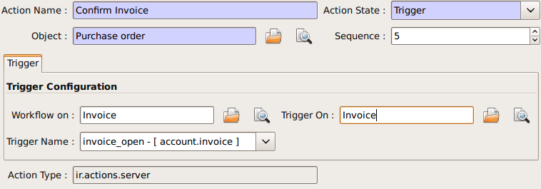

=============
Server Action
=============

Introduction
------------

Server action is an new feature available since the OpenERP
version 5.0 beta. This is an useful feature to fulfill customer
requirements. It provides a quick and easy configuration for day to
day requirements such as sending emails on confirmation of sale
orders or invoice, logging operations on invoices (confirm, cancel,
etc.), or running wizard/report on confirmation of sales, purchases,
or invoices.

Step 1: Definition of Server Action 
-----------------------------------

Here is the list of the different action types supplied under the Server Action.

       * Client Action
       * Dummy
       * Iteration
       * Python Code
       * Trigger
       * Email
       * SMS
       * Create Object
       * Write Object
       * Multi Action

Each type of action has special features and different configuration
parameters. The following sections review each action type and
describe how to configure them, together with a list of parameters affecting the system.

Client Action
~~~~~~~~~~~~~

This action executes on the client side. It can be used to run a
wizard or report on the client side. For example, a Client Action can
print an invoice after it has been confirmed and run the payment wizard. Technically we
can run any client action executed on client side. This includes ir.actions.report.custom,
ir.actions.report.xml, ir.actions.act_window, ir.actions.wizard, and
ir.actions.url. In the following example, we can configure a
Client Action to print the invoice after it has been confirmed.

.. image:: images/client_action.png

Important fields are:

:Object: the object affected by the workflow on for which we want to
         run the action
:Client Action: the client action, which will be executed on the
                client side. It must have one of the following types:

* ir.actions.report.custom
* ir.actions.report.xml
* ir.actions.act_window
* ir.actions.wizard
* ir.actions.url

Iteration
~~~~~~~~~

Using a Python loop expression, it is possible to iterate over a
server action.  For example, when confirming a inward stock move, each
line item must be historized. You can loop on expression object.move_lines and create another server action which is referred to do the historizing job.

Python Code
~~~~~~~~~~~

This action type is used to execute multiline python code. The
returned value is the value of the variable ``action``, defaulting to
``{}``. This makes sense only if you want to pop a specific
window(form) specific to the context, but a return value is generally
not needed.

Note: The code is executed using Python's ``exec`` built-in
function. This function is run in a dedicated namespace containing the
following identifiers: ``object``, ``time``, ``cr``, ``uid``, ``ids``.

Trigger
~~~~~~~~

Any transition of the workflow can be triggered using this action. The
options you need to set are:

:Object: the object affected by the workflow on for which we want to
         run the action
:Workflow on: The target object on which you want to trigger the
                 workflow.
:Trigger on: the ID of the target model record, e.g. Invoice if you want to trigger a change on an invoice. 
:Trigger Name: the signal you have to use to initiate the
               transition. The drop down lists all possible
               triggers. Note: the list contains all possible
               transitions from other models also, so ensure you
               select the right trigger. Models are shown in brackets. 

The following example shows the configuration of a trigger used to
automatically confirm invoices:

Email Action
~~~~~~~~~~~~~

This action fulfills a  common requirement for all business process, sending a confirmation by email
whenever sales order, purchase order, invoice, payment or shipping of
goods takes place. 

Using this action does not require a dedicated email
server: any existing SMTP email server and account can be used,
including free email account (Gmail, Yahoo !, etc...)

*Server Configuration*

The OpenERP server must know how to connect to the SMTP server. This
can be done from the command line when starting the server or by
editing the configuration file. Here are the command line options:

::

  --email-from=<sender_email@address>
  --smtp=<smtp server name or IP address>
  --smtp-port=<smtp server port>
  --smtp-user=<smtp user name, if required>
  --smtp-password=<smtp user password, if required>
  --smtp-ssl=<true if the server requires SSL for sending email, else false>

.. **

Here is an example configuration an action which sends an email when
an invoice is confirmed

.. image:: images/email_action.png

Important Fields are:

:Object: the object affected by the workflow on for which we want to
         run the action
:Contact: the field from which action will find the email address of
          the recipient of the email. The system will displays all the
          fields related to the object selected in the Object field. 
:Message: the message template with the fields that will filled using
          the current object. The notation is the same as the one used
          RML to design reports: you can use the [[ ]] + HTML tags to
          design in the HTML format. For example to get the partner
          name we can use [[ object.partner_id.name ]], object refers
          to the current object and we can access any fields which
          exist in the model.

After configuring this action, whenever an invoice is confirmed, an
email such as the following is sent:

.. image:: images/email_confirm.png

Create Object
~~~~~~~~~~~~~

This type of action can be used to emulate the Event history feature currently
available on Partners, which logs sales orders issued by a partner, on
other objects which do not natively support this feature, such as
invoices:

.. image:: images/create_object.png

Create Object action configuration can be tricky, since it is
currently necessary to remember the field names (or to check them out
from the source code itself). There are plans to provide an
expression builder inside OpenERP in the future, which will be useful
to build complex expressions.

Important fields are:

:Object: the object affected by the workflow on for which we want to
         run the action
:Model: the target model for the object to be created. If empty, it
        refers to the current object and allows to select the fields
        from it. It is recommended to provide a model in all cases. 
:Fields Mapping: Need to provide 3 values:

1. *Destination*: any of the fields from the target model
2. *Type*: the type of the mapping. Allowed values are ``value`` or ``formula``
3. *Value*: provide the value or expression the expression. The
   ``object`` refers to the current object.

*You must select the all required fields from the target model*

:Record Id: the field in which the  id of the new record is
            stored. This is used to refer to the same object in future
            operations (see below)

Write Object
~~~~~~~~~~~~~

The configuration is very similar to the Create Object actions. The
following example writes 'Additional Information' on the same object

.. image:: images/write_object.png

Important Fields are

  **same as the Create Object**

Multi Action
~~~~~~~~~~~~~

This action allows to execute  multiple server actions on the same
business operation. For instance, it can be used to print *and* send
an email on confirmation of an invoice. This requires creating 3 server actions:

  * Print Invoice
  * Invoice Confirmation Email !!
  * Multi Action

There is a fundamental restriction on this action: it can execute many actions at the server side, but only
one single client action. It is therefore not possible to print a
report and execute a wizard at the same time. 

.. image:: images/multi_action.png

Important Fields are:

:Object: the object affected by the workflow on for which we want to
         run the action
:Other Actions: the list of server action. Any number of actions can
                be selected, but beware of the restriction mentioned
                above: if you select more than one Client action, only
                the first will be executed. 

Step 2: Mapping Server actions to workflows
-------------------------------------------

Server actions by themselves are useless, until a workflow stage is
set up to trigger them.

Workflows can be accessed at: Administration >> Customization >>
Workflow Definitions >> Workflows. Open the corresponding workflow,
edit the stage at which the server action needs to be triggered. Then 
Select the server action in the box.

The following example shows how to associate the Print invoice action
to the Open state of the Invoice workflow:

.. image:: images/link_workflow.png

