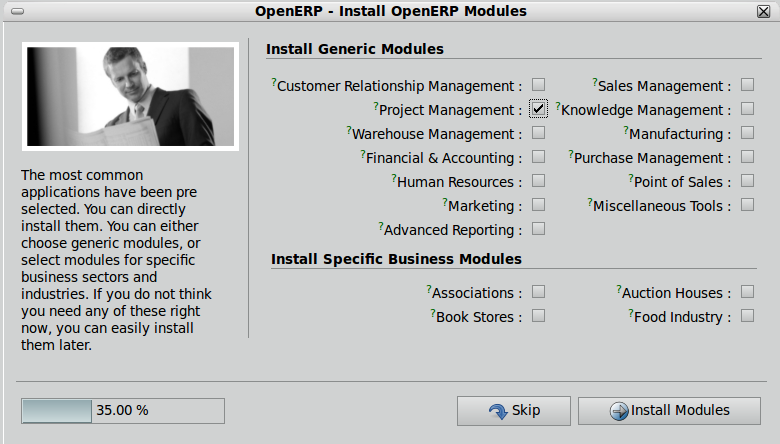

=====================
Business Applications
=====================

Defining new applications or completing existing ones
+++++++++++++++++++++++++++++++++++++++++++++++++++++

We usually try to define new business applications related to job positions in the enterprise. These are good examples of applications : Purchase, Sales, Accounting, Project, etc. Don't create business application by features. These are wrong examples of business applications : lunch orders management, expenses sheets, etc.

If you have specific features that do not belong the existing business applications, you can put them in the “Miscelleanous Tools” application.

Configuration wizards of business applications.
+++++++++++++++++++++++++++++++++++++++++++++++

Each application must create an entry in the main base_setup wizard that shows all the possible business applications defined in quality certified modules only.

You can also create one configuration wizard dedicated to your business application. Example, when you install the project management, you get this wizard:

.. figure:: Pictures/1.3.Project_management.png
   :align: center

Business Applications must be complete
++++++++++++++++++++++++++++++++++++++

One user/role must be able to perform most of his tasks from one business application. He should not be forced to switch to another application to perform the tasks of the same role. Example, a salesman should see in his menu: Leads, Opportunities, Meetings, Sales Orders, Sales to Invoice, etc. He should not be forced to go to the accounting application to invoice the sales.

Transversal features, used by all applications
++++++++++++++++++++++++++++++++++++++++++++++

Some features should be accessible by all users, not depending on the application they usually works in. As an example, most of the users should have an access to: Partners, Agenda of Meetings, Products. In that case, you put the menu in the applications that needs these features more. (Example: the address book is in the sales, purchases and accounting application)
And, these features must be set as shortcuts for every user in the system by default, at the creation of the user.

Access Rights must define groups per application.
+++++++++++++++++++++++++++++++++++++++++++++++++

The groups defined by each module must be directly related to business application. So, if you have an application which is “Accounting”.  All groups within this application must be like: “Accounting / Accountant”, “Accounting / Financial Manager”, etc.

One dashboard defined per application
+++++++++++++++++++++++++++++++++++++

Each business application must have one dashboard attached to his root menuitem. When a user enters in a business application, he should see the dashboard related to this application.

